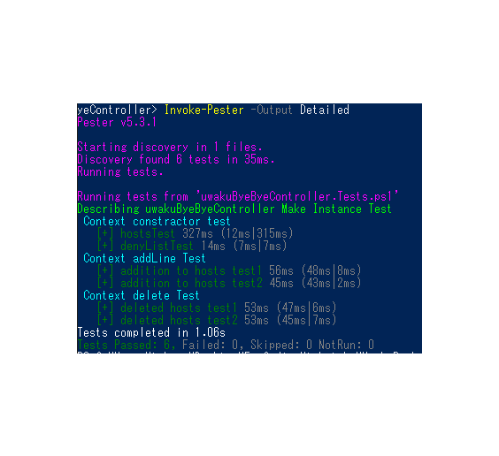

- [Pesterについて](#pesterについて)
  - [Pesterとは何か](#pesterとは何か)
  - [基本の使い方](#基本の使い方)
    - [テスト対象を取得してくる](#テスト対象を取得してくる)
    - [テスト項目記述部分](#テスト項目記述部分)
  - [テストの実施](#テストの実施)
  - [実際に使ってみた](#実際に使ってみた)
  
# Pesterについて

## Pesterとは何か

PowerShell向けのテストフレームワーク

参考:[https://pester.dev/](https://pester.dev/)

これのおかげでpowershellのテストコードを書いて単体テストをきっちりできるよ。

今はv5が最新だと思われる。

`Install-Module Pester -Force`

でインストールできる。

テストしたい`XXX.ps1`というスクリプトに対して
`XXX.Tests.ps1`というテストスクリプトを用意してあげる。

手で用意してあげてもいいけど
`New-Fixture -Name XXX`でカレントディレクトリにテンプレ付きの上記セットができあがる。

## 基本の使い方

大まかにはテスト対象を取得してくる部分とその下に続くテスト項目の部分とに分けられる。

### テスト対象を取得してくる

v5では以下のように実行するテストスクリプトのパスを書き換えて読み込んでくる。

テンプレではテストスクリプトと同じカレントディレクトリにテスト対象になるスクリプトがある想定らしいが、テストファイルファイル同士別ディレクトリにまとめてたりで都合が悪い場合は適宜リプレースする部分を変えてやるといいみたい。

```console
BeforeAll {
    . $PSCommandPath.Replace('XXX.Tests.ps1', 'XXX.ps1') 
}
```

### テスト項目記述部分

こんな感じで階層化して整理して記述できる。
Contextは大きなまとまりってかんじかな。
Itはテスト一項目。って認識。
観点や単位ごとに分けると良いかなと感じた。

Describe
└Context
　└It

こんな感じで

```console
Describe "XXXFunctionTest"{
    Context "正常系" {
        It "境界値 min"{

        }
        It "境界値 max"{

        }
    }
    Context "異常系" {
        It "境界値 min -1"{

        }
        It "境界値 max + 1"{

        }
    }
    Context "例外テスト" {
        It "数値以外"{

        }
        It "null"{
            
        }
    }
}
```

又、それぞれBefore・After処理を行って前処理や後処理をIt実行ごととかテスト開始時とかに行える。

## テストの実施

テストスクリプトがあるディレクトリで`Invoke-Pester`を実行
`-Output Detailed`を詳しく見れる。

## 実際に使ってみた

- test1
  
**code**

```console
class uwakuByeByeController{
   # 静的プロパティ
   $denyList
   [String]$hosts

   # コンストラクター
   uwakuByeByeController ([String] $json,[String] $hosts){
       $this.denyList = Get-Content $json -Encoding UTF8 -raw | ConvertFrom-Json
       $this.hosts = $hosts       
   }

   # add
   [void]addLine(){
       [String]$strBuilder = "#Added by uwakuByeByeController`r`n"
       for ($i = 0; $i -lt $this.denyList.deny.Count; $i++){ 
           $strBuilder += "0.0.0.0 " + $this.denyList.deny[$i] + "`r`n"
       }
        
       $strBuilder += "#End of Section by uwakuByeByeController`r`n" 
       $strBuilder | Out-File $this.hosts -Encoding UTF8 -Append
   }

   # delete
   [void]deleteLine(){
       $start =  (Select-String -Pattern "#Added by uwakuByeByeController" -Path $this.hosts).ToString().Split(":")[2]
       $end = (Select-String -Pattern "#End of Section by uwakuByeByeController" -Path $this.hosts).ToString().Split(":")[2]
       $strBuilder = Get-Content -Path $this.hosts -Encoding UTF8 | Select-Object -First ($start-1)
       $leftStrBuilder = Get-Content -Path $this.hosts -Encoding UTF8 | Select-Object -Skip $end
       for ($i = 0; $i -lt $leftStrBuilder.Length; $i++){ 
           $strBuilder += $leftStrBuilder[$i] + "`r`n"
       }

       $strBuilder | Out-File $this.hosts -Encoding UTF8

   }

}
```

**test code**

```console
BeforeAll {
    . $PSCommandPath.Replace('test\uwakuByeByeController\uwakuByeByeController.Tests.ps1', 'uwakuByeByeController.ps1') 
    $DIR = Get-Location 
    $script:JSONFILE = Join-Path -Path $DIR -ChildPath ".\dammy.json"
    $script:hosts = Join-Path -Path $DIR -ChildPath ".\dammyhosts.txt"
}

Describe "uwakuByeByeController Make Instance Test" {
    Context "constractor test" {
        BeforeEach{
            $script:obj = [uwakuByeByeController]::new($JSONFILE,$hosts)
        }
        It "hostsTest" {
            (Get-Content $obj.hosts) | Should -Be "#test"
        }
        It "denyListTest" {
            $obj.denyList.deny[0] | Should -Be "www.dammy.com"
        }
    }

    Context "addLine Test" {
        BeforeEach{
            $obj = [uwakuByeByeController]::new($JSONFILE,$hosts)
            $obj.addLine()
        }
        It "addition to hosts test1" {
            (Select-String -Pattern "www.dammy.com" -Path $hosts).ToString().Split(":")[3] | Should -Be "0.0.0.0 www.dammy.com"
        }
        It "addition to hosts test2" {
            (Select-String -Pattern "www.nothing.co.jp" -Path $hosts).ToString().Split(":")[3] | Should -Be "0.0.0.0 www.nothing.co.jp"
        }
        AfterEach{
            $obj.deleteLine()
        }
    }

    Context "delete Test" {
        BeforeEach{
            $obj = [uwakuByeByeController]::new($JSONFILE,$hosts)
            $obj.addLine()
            $obj.deleteLine()
        }
        It "deleted hosts test1" {
            Select-String -Pattern "www.dammy.com" -Path $hosts | Should -BeNullOrEmpty
        }
        It "deleted hosts test2" {
            Select-String -Pattern "www.nothing.co.jp" -Path $hosts | Should -BeNullOrEmpty
        }
    }
}
```

**実施結果**


- test2
  
**code**

```console
class secValidationChk{
   [int] $secNum

   secValidationChk([int]$sec){
       if($this.setSecNum($sec) -eq $false){
           $this.secNum = 0
       }else{
           $this.secNum = $sec
       }       
   }

   [int] getSecNum(){
       return $this.secNum
   }

   [boolean] setSecNum([int]$sec){
       if ($sec -isnot [int32]){return $false}
       if ($sec -lt 1){return $false}
       return $true
   }

}
```

**test code**

```console
BeforeAll {
    . $PSCommandPath.Replace('test\secValidationChk\secValidationChk.Tests.ps1', 'secValidationChk.ps1') 
}

Describe "secValidationChk Make Instance Test" {
    Context "簡単なテスト" {
        It "sec = 1 except 1" {
            $waitTime = 1
            $obj = [secValidationChk]::new($waitTime)
            $obj.getSecNum() | Should -Be 1
        }
        It "sec = 0 except 0" {
            $waitTime = 0
            $obj = [secValidationChk]::new($waitTime)
            $obj.getSecNum() | Should -Be 0
        }
        It "sec = -1 except 0" {
            $waitTime = -1
            $obj = [secValidationChk]::new($waitTime)
            $obj.getSecNum() | Should -Be 0
        }
    }
}
```

**実施結果**

